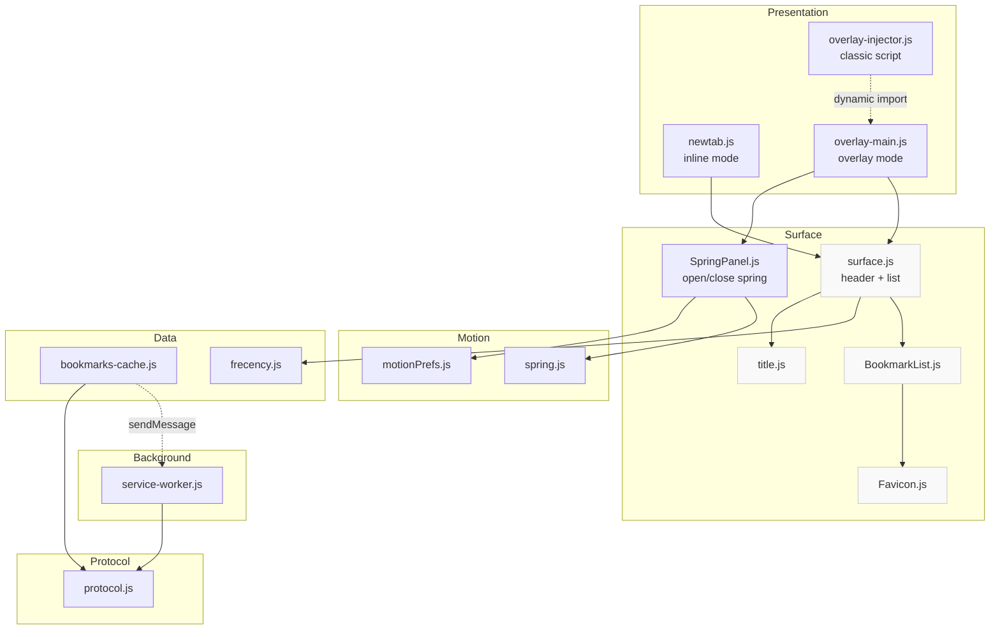
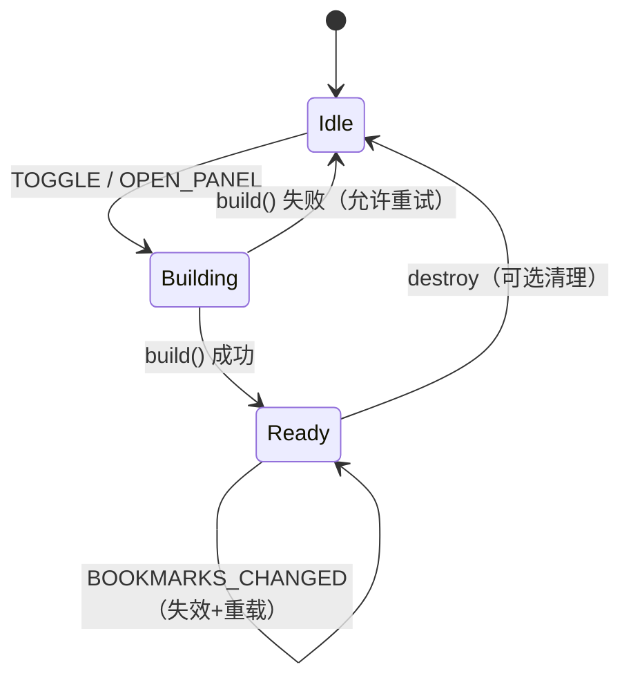
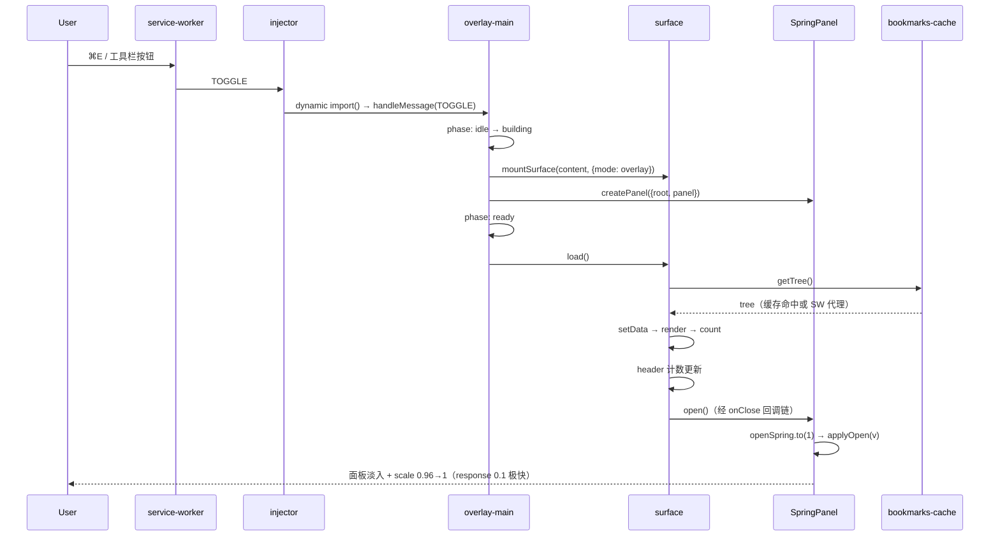

# DuckMark 架构设计文档

> v4 — noting-design（Vercel × Geist × Apple × Nothing：单色工业 + 点阵身份 + 边框优先）
> 日期：2026-09-14

---

## 目录

1. [设计哲学](#1-设计哲学)
2. [分层架构](#2-分层架构)
3. [模块职责](#3-模块职责)
4. [模块关系图](#4-模块关系图)
5. [接口规范](#5-接口规范)
6. [数据流与状态机](#6-数据流与状态机)
7. [用户交互流程](#7-用户交互流程)
8. [视觉系统（v4 重设计）](#8-视觉系统v4-重设计)
9. [实现路线图](#9-实现路线图)

---

## 1. 设计哲学

### 1.1 四源融合策略（noting-design §27）

> Apple 设计交互，Vercel 设计结构，Geist 设计系统，Nothing 设计视觉身份。

**Apple 主导行为**——克制与可预测：

| Apple 原则 | DuckMark 实现 |
|-----------|--------------|
| **Response** (§1) | 按压即时反馈（`:active` 100ms）、懒加载、缓存优先 |
| **Interruptibility** (§3) | 开合弹簧单实例，open/close 永远 re-target，从 live 值继续 |
| **Behavior over Animation** (§4) | 弹簧驱动面板开合：damping 1.0 / response 0.1（临界阻尼） |
| **Spatial Consistency** (§7) | 面板固定 15vh 居中，对称开合路径，固定尺寸 900×700 |
| **Materials & Depth** (§12) | 唯一玻璃层 = 面板本体（blur 12px 极克制）；内部实底 |
| **Typography** (§15) | 大标题负 tracking、小标签微正 tracking、600 weight 建层级 |
| **Reduced Motion** (§14) | 三套降级：motion / transparency / contrast 全链路 |
| **Wayfinding** (§16) | 头部「[icon] DuckMark + N BOOKMARKS」 |

**Vercel 主导结构**——极简与精确：

| Vercel 特征 | DuckMark 实现 |
|------------|--------------|
| 高信息密度 | 列表行 40px、gap 4px、四列网格 |
| 清晰边界 | 1px hairline 定义一切结构 |
| 工程感 | 等宽字计数、技术标签、无装饰渐变 |

**Geist 主导系统**——令牌一致性：

| Geist 特征 | DuckMark 实现 |
|-----------|--------------|
| 8px 间距基 | 4/8/12/16/24/32/48 全令牌化 |
| 组件同源 | 所有组件共享同一 radius/border/type 令牌 |
| 层级 ≤ 3 | text → secondary → tertiary |

**Nothing 主导视觉身份**——单色工业：

| Nothing 特征 | DuckMark 实现 |
|-------------|--------------|
| 点阵系统（§4） | 20px 网格、1px 点、单色低透明度；页面背景/空态/骨架 |
| 禁止彩虹（§3） | favicon 回退 = 边框盒 + mono 首字母；icon grayscale(1) |
| 工业半径（§7） | panel 8 / card 4 / favicon 3 |
| 技术化表达（§19/20） | 空态大写点阵、骨架点阵化 |

**克制原则**：v4 相对 v3 零新组件、零新交互——只做视觉身份的工业化收敛（替换彩虹 favicon 色板、引入点阵、收紧半径、收敛玻璃）。架构与功能完全继承 v3.2。

---

## 2. 分层架构

```
┌─────────────────────────────────────────────────────────────────┐
│  PRESENTATION    newtab.js (inline) / overlay-main.js (overlay)  │
│                  overlay-injector.js (classic 懒加载入口)         │
├─────────────────────────────────────────────────────────────────┤
│  SURFACE         surface.js (共享表层 + wayfinding header)        │
│                  BookmarkList.js (四列网格+分区计数)              │
│                  Favicon.js / title.js / SpringPanel.js          │
├─────────────────────────────────────────────────────────────────┤
│  MOTION          spring.js (阻尼弹簧) / motionPrefs.js (降级信号) │
│                  gesture.js (clamp)                              │
├─────────────────────────────────────────────────────────────────┤
│  DATA            bookmarks-cache.js / frecency.js                │
├─────────────────────────────────────────────────────────────────┤
│  PROTOCOL        shared/protocol.js (消息契约 MSG 常量)           │
└─────────────────────────────────────────────────────────────────┘
                    ↓
        Chrome APIs: bookmarks / tabs / favicon
```

依赖方向严格单向：Presentation → Surface → (Motion | Data) → Protocol → Chrome APIs。

**v4 变更**：Data 层移除 `state/store.js`（v3.2 删除用户拉伸后，尺寸偏好持久化已无消费方；manifest 的 storage 权限保留给 frecency）。

---

## 3. 模块职责

### 3.1 Motion Layer

| 模块 | 职责 | 接口 |
|-----|------|------|
| `spring.js` | 阻尼谐波弹簧求解器（半隐式 Euler，8 子步） | `createSpring({ damping, response, from, onUpdate, onRest })` |
| `motionPrefs.js` | reduced-motion 运行时信号 | `prefersReducedMotion()`, `onMotionPrefChange()` |
| `gesture.js` | 值钳制工具 | `clamp(v, min, max)` |

**设计决策**：面板开合用 `damping 1.0, response 0.1`（临界阻尼 + 极快到位，v3.3 从 0.4 逐步调优至此）。

### 3.2 Surface Layer

| 模块 | 职责 |
|-----|------|
| `surface.js` | 共享渲染容器：wayfinding 头部（icon+标题+mono 计数）+ 书签网格 |
| `SpringPanel.js` | 面板物理外壳：开合弹簧（可中断）+ 焦点归还（固定尺寸，无拉伸） |
| `BookmarkList.js` | 四列分区网格、浏览器原生 Tab 导航、分区计数 |
| `Favicon.js` | favicon 获取（`_favicon` API）+ 单色工业回退（边框盒+mono 首字母） |
| `title.js` | 标题推导（回退到 URL 主机名） |

### 3.3 Data Layer

| 模块 | 职责 |
|-----|------|
| `bookmarks-cache.js` | 书签树缓存 + 变更监听（content script 经 SW 代理） |
| `frecency.js` | 打开频率统计 → 常用区 Top 8 |

### 3.4 Protocol Layer

```javascript
MSG = {
  TOGGLE: "dm-toggle",            // ⌘E / 工具栏按钮
  OPEN_PANEL: "dm-open-panel",
  CLOSE_PANEL: "dm-close-panel",
  GET_TREE: "dm-get-tree",        // content → SW 代理 chrome.bookmarks
  OPEN_BOOKMARK: "dm-open",       // content → SW 打开标签页
  BOOKMARKS_CHANGED: "dm-bookmarks-changed",  // SW 广播失效
}
```

---

## 4. 模块关系图

### 4.1 依赖关系



### 4.2 状态机



---

## 5. 接口规范

### 5.1 spring.js

```javascript
/**
 * @param {Object} options
 * @param {number} [options.damping=1.0]  阻尼比。1.0=临界（无过冲）
 * @param {number} [options.response=0.4]  响应时间（秒）
 * @param {number} [options.from=0]        初始值
 * @param {(value: number, velocity: number) => void} [options.onUpdate]
 * @param {() => void} [options.onRest]
 * @returns {Spring}
 *
 * @typedef Spring
 * @property {(v: number) => void} set   立即跳值（初始化用）
 * @property {(t: number, initVelocity?: number) => void} to  re-target，可带初速
 * @property {number} value
 * @property {number} target
 * @property {() => void} stop
 */
export function createSpring(options) {}
```

### 5.2 surface.js

```javascript
/**
 * @typedef {Object} SurfaceOptions
 * @property {"overlay"|"inline"} mode
 * @property {(url: string, newTab: boolean) => void} openBookmark
 * @property {(() => void)|null} [onClose]   overlay 打开书签后收起
 *
 * @typedef {Object} SurfaceHandle
 * @property {() => Promise<void>} load     拉取数据并重渲染（幂等）
 * @property {() => void} destroy           退订监听
 */
export function mountSurface(content, opts) {}
```

### 5.3 SpringPanel.js

```javascript
/**
 * @typedef {Object} PanelDeps
 * @property {HTMLElement} root            遮罩根（.bookmark-open）
 * @property {HTMLElement} panel           玻璃面板
 *
 * @typedef {Object} PanelController
 * @property {() => void} open    弹簧打开（可中断）
 * @property {() => void} close   弹簧关闭（可中断，焦点立即归还）
 * @property {() => boolean} isOpen
 * @property {() => void} destroy
 */
export function createPanel(deps) {}
```

### 5.4 BookmarkList.js

```javascript
/**
 * @param {HTMLElement} container
 * @param {Object} opts
 * @param {(item: {id: string, title: string, url: string}, event: Event) => void} [opts.onOpen]
 * @returns {{
 *   setData: (tree: object, frequent: object[]) => void,
 *   render: () => void,
 *   count: () => number,          // 总书签数（供头部显示）
 * }}
 */
export function createBookmarkList(container, opts) {}
```

### 5.5 Data

```javascript
// bookmarks-cache.js
export async function getTree() {}        // 缓存优先；content script 经 SW 代理
export function watch() {}               // extension page 直连 chrome.bookmarks 事件
export function onChanged(cb) {}          // → 返回退订函数
export function invalidate() {}
export function notifyChanged() {}       // content 收到 SW 广播后调用

// frecency.js
export async function recordOpen(id) {}
export async function getTopIds(n = 8) {}
```

---

## 6. 数据流与状态机

### 6.1 打开面板（时序）



### 6.2 数据流原则

1. **单向**：Data → Surface → DOM，禁止反向
2. **缓存优先**：`getTree()` 命中直接返回；extension page 直连，content script 经 `GET_TREE` 消息代理
3. **失效而非推送**：`BOOKMARKS_CHANGED` 只失效缓存，订阅者自行重新 `load()`
4. **订阅去重**：`onChanged` 订阅在 `load()` 之外注册一次，重复打开不叠加监听

---

## 7. 用户交互流程

### 7.1 键盘（浏览器原生）

tiles 是真实 `<a href>` 链接——Tab / Shift+Tab 顺序导航、focus-visible 焦点环、
Enter 跟随链接，全部由浏览器原生承担，零自绘键盘系统。

### 7.2 打开书签

```
click / 中键 → handleOpen(item, event)
  → newTab = 修饰键 ? !默认 : 默认        （overlay 默认 true，inline 默认 false）
  → recordOpen(item.id)                  （frecency，常用区数据源）
  → opts.openBookmark(url, newTab)
  → overlay 模式：opts.onClose?.() 收起面板
```

### 7.3 关闭面板（两条路径）

1. **backdrop 点击**：遮罩 → close()
2. **打开书签后**：onClose → close()

两者共用同一 `close()`：弹簧 re-target 到 0，焦点立即归还原宿主元素。

---

## 8. 视觉系统（v4 重设计）

### 8.1 设计令牌（tokens.css）

| 令牌族 | v3（jay-design） | v4（noting-design） |
|-------|----|----|
| 背景 | 暖中性 `#fafafa` | 工业冷灰 `#ffffff` / 近黑 `#0a0a0a` |
| 圆角 | panel 12 / card 6 / favicon 4 | panel 8 / card 4 / favicon 3 |
| favicon 回退 | 12 色彩虹色板哈希 | 单色工业 tile：边框盒 + inset 底 + mono 首字母 |
| 点阵 | 无 | `--dm-dot-*` 令牌族：20px 网格、1px 点、双透明度 |
| 玻璃 | blur 20px + saturate 160% | blur 12px 纯净、透明度 0.88、无 saturate |
| header icon | 彩色 logo | `filter: grayscale(1)` 强制单色 |
| 空态 | 普通灰字 | 点阵背景 + 大写技术文案（§19） |
| 骨架 | 纯色呼吸块 | 点阵纹理呼吸（§20） |
| scrim | 0.32 | 0.24（更轻的焦点转移） |

### 8.2 点阵系统（Nothing §4）

- 20px 网格、1px 点、单色、低透明度（亮 10% / 暗 10%）
- 应用面：newtab 页面背景（fixed，滚动不带走）、空态、骨架屏
- 降级：`prefers-reduced-transparency: reduce` 时点阵退场保纯色
- 纪律：绝不与主内容竞争（正文区域靠 surface 实底隔离）

### 8.3 无障碍降级（三套，全链路）

| 信号 | 降级行为 |
|-----|---------|
| `prefers-reduced-motion: reduce` | CSS 端 transition 压到 0.01ms；JS 端 `applyOpen` 只动 opacity（交叉淡入），面板不缩放/位移 |
| `prefers-reduced-transparency: reduce` | 玻璃令牌切实底，`backdrop-filter` 摘除，页面点阵退场 |
| `prefers-contrast: high` | 边框加深至 40-65% 不透明度，副文本提级，阴影归零 |

### 8.4 交互三态

| 状态 | 卡片表现 |
|-----|---------|
| default | surface 底 + hairline 边框 |
| hover | 背景 `--dm-hover`、边框 +1 级（**不缩放**） |
| pressed | `scale(0.98)` + 边框 +2 级（100ms） |
| focus-visible | 2px outline 双环（浏览器原生 Tab 焦点） |

---

## 9. 实现路线图

v4 视觉工业化已完成。剩余增量：

### Phase A：打磨（优先）

- [ ] 深色模式下玻璃面板对比度实测（4.5:1）
- [ ] 点阵在大屏（>1440px）的视觉密度实测

### Phase B：测试覆盖

- [ ] `spring.js` 单元测试：临界阻尼收敛、re-target 无跳变
- [ ] `frecency.js` 评分计算
- [ ] `bookmarks-cache.js` 缓存/失效/代理路径
- [ ] preview.html 扩展为交互原型

### Phase C：可选扩展（保持克制，按需取舍）

- [ ] inline 模式的常用区（当前仅 overlay 有 frecency 区）
- [ ] 状态点语义（§21：● ONLINE 式同步状态指示）

---

## 附录 A：设计决策记录

**A.1 为什么 v4 移除彩虹 favicon 回退色板？** noting-design §3：黑白主导，禁止 rainbow interface。12 色哈希色板让每个加载失败的 tile 变成随机彩色装饰——视觉噪声 + 与单色系统冲突。单色工业 tile（边框盒 + mono 首字母）反而强化身份：回退态看起来像系统的一部分，而非故障。

**A.2 为什么点阵用 fixed 背景？** 页面滚动时点阵保持视角静止（§4 geometric alignment），内容在点阵上流动——工业感来自"内容浮于系统网格之上"的层次隐喻。

**A.3 为什么 v3.2 移除用户拉伸？** 固定尺寸消除状态管理复杂度：无需 store.js、无需尺寸偏好持久化、无需 clamp 边界逻辑。900×700 四列布局在主流桌面分辨率下每列 ~220px，标题可读性已验证。

**A.4 为什么 CSS transitions 仍不用于面板开合？** 无法被中断并反向。弹簧从 live 值起步，open 到一半 close 零跳变（Apple §3）。

**A.5 为什么参数用 damping/response？** Apple 设计工具的两参数模型：`1.0` 临界阻尼无过冲，`response` 是大致到达时间而非固定 duration，对调参者更直观。

**A.6 为什么 content script 用 dynamic import？** Content scripts 是 classic script，顶层 `import` 抛错。动态 import 保持在 isolated world（可访问 chrome.*），同时实现首次交互才加载整个 ESM 模块图。

**A.7 为什么书签树要解包？** `chrome.bookmarks.getTree()` 返回 `[rootNode]`，消费方走 `tree.children`；不解包 overlay 渲染为空。

**A.8 为什么 v3.1 移除自绘键盘系统？** 书签面板是短停留的临时界面：鼠标/中键是主路径。tiles 本来就是真实 `<a href>`——浏览器原生 Tab 导航、focus-visible 焦点环、Enter 跟随链接免费获得且行为可预测（Apple §16 Familiarity）。

**A.9 为什么 icon 加 grayscale(1)？** logo.png 本身可能含彩色，grayscale 强制归一为单色身份（§3 monochrome by default）。产品标识靠形状而非色彩记忆（Nothing 的品牌策略）。

---

## 附录 B：术语表

| 术语 | 定义 |
|-----|------|
| **Presentation value** | 元素当前屏幕实际值（transform/opacity），动画永远从此起步 |
| **Damping ratio** | 阻尼比。1.0 = 临界（无过冲） |
| **Response** | 响应时间（秒），非固定 duration |
| **Hairline** | 1px 细边框，承担卡片全部结构 |
| **Dot matrix** | Nothing 点阵系统：等距单色点网格，低透明度视觉身份 |
| **Wayfinding** | 每屏回答：我在哪 / 能去哪 / 怎么出去 |

---

*文档结束*